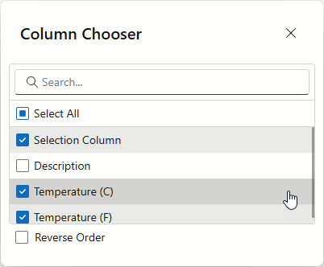

<!-- default badges list -->

[](https://supportcenter.devexpress.com/ticket/details/T1313893)
[](https://docs.devexpress.com/GeneralInformation/403183)
[](#does-this-example-address-your-development-requirementsobjectives)
<!-- default badges end -->

# Blazor Grid – How to Implement a Custom Column Chooser with Integrated Sorting, Search, and Select All Capabilities

This example implements a custom Column Chooser dialog for the [DevExpress Blazor Grid](https://docs.devexpress.com/Blazor/403143/components/grid) component. The dialog includes the following features/capabilities:

* Allows users to toggle column visibility
* Displays Grid columns in alphabetical order
* Displays a Search Box
* Includes a Select All check box



Use buttons above our Blazor Grid component to open custom and built-in Column Chooser dialogs and compare associated functionality.

## Implementation Details

### Display Grid Columns

Use the [DevExpress Blazor List Box](https://docs.devexpress.com/Blazor/DevExpress.Blazor.DxListBox-2) component to display Grid columns in a custom Column Chooser dialog. Retrieve a column collection from the Grid, exclude columns whose [ShowInColumnChooser](https://docs.devexpress.com/Blazor/DevExpress.Blazor.DxGridColumn.ShowInColumnChooser) property is set to `false`, and assign the resulting collection to the List Box:

```razor
<DxListBox Data="@AllColumns"
           TextFieldName="Caption"
           Values="VisibleColumns">
</DxListBox>
```

```csharp
private void InitializeColumnList() {
    AllColumns = MyGrid.GetColumns().Where(i => i.ShowInColumnChooser).OrderBy(i => i, ColumnsComparerImpl.Default).ToList();
    VisibleColumns = MyGrid.GetVisibleColumns();
}
```

### Toggle Column Visibility

Activate the [ShowCheckboxes](https://docs.devexpress.com/Blazor/DevExpress.Blazor.DxListBox-2.ShowCheckboxes) property to display item checkboxes. Switch the List Box to multi-select mode and synchronize selected items with visible Grid columns:

```razor
<DxListBox ...
           ShowCheckboxes="true"
           SelectionMode="ListBoxSelectionMode.Multiple"
           ValuesChanged="@((IEnumerable<IGridColumn> values) => SelectedDataItemsChanged(values))">
</DxListBox>
```

```csharp
void SelectedDataItemsChanged(IEnumerable<IGridColumn> values) {
    VisibleColumns = values;
    UpdateColumnsVisibility();
}
void UpdateColumnsVisibility() {
    MyGrid.BeginUpdate();
    var columnCollection = MyGrid.GetColumns();
    foreach (var column in columnCollection)
        if (column.ShowInColumnChooser)
            column.Visible = VisibleColumns.Contains(column);
    MyGrid.EndUpdate();
}
```
### Add Select All and Search Features

Activate the [ShowSelectAllCheckbox](https://docs.devexpress.com/Blazor/DevExpress.Blazor.DxListBox-2.ShowSelectAllCheckbox) property to display a Select All checkbox. Use the [ShowSearchBox](https://docs.devexpress.com/Blazor/DevExpress.Blazor.DxListBox-2.ShowSearchBox) option to add search functionality in the List Box:

```razor
<DxListBox ...
           ShowSearchBox="true"
           ShowSelectAllCheckbox="true">
</DxListBox>
```

### Sort Columns

Implement a comparer to sort List Box items in the following order:

1) Selection column
2) Command column
3) Data columns, sorted alphabetically by caption/field name

```csharp
class ColumnsComparerImpl : IComparer<IGridColumn> {
    public static IComparer<IGridColumn> Default { get; } = new ColumnsComparerImpl();
    ColumnsComparerImpl() { }
    int IComparer<IGridColumn>.Compare(IGridColumn x, IGridColumn y) {
        if (x is IGridSelectionColumn)
            return -1;
        if (x is IGridCommandColumn && y is IGridDataColumn)
            return -1;
        if (x is IGridDataColumn xData && y is IGridDataColumn yData) {
            var xName = !string.IsNullOrEmpty(xData.Caption) ? xData.Caption : xData.FieldName;
            var yName = !string.IsNullOrEmpty(yData.Caption) ? yData.Caption : yData.FieldName;
            return string.Compare(xName, yName);
        }
        return 0;
    }
}
```

Add a [CheckBox editor](https://docs.devexpress.com/Blazor/DevExpress.Blazor.DxCheckBox-1) that changes sort order dynamically:

```razor
<DxCheckBox Checked="ReverseOrder" CheckedChanged="@((bool value) => OnReverseOrder(value))">
    Reverse Order
</DxCheckBox>
```

```csharp
private void OnReverseOrder(bool newValue) {
    ReverseOrder = newValue;
    AllColumns = AllColumns.Reverse();
}
```

## Files to Review

- [Index.razor](CS/Components/Pages/Index.razor)
- [site.css](CS/wwwroot/css/site.css)

## Documentation

- [Blazor Grid – Column Chooser](https://docs.devexpress.com/Blazor/404479/components/grid/columns/columns#column-chooser)
- [Blazor List Box – Item Selection](https://docs.devexpress.com/Blazor/405403/components/data-editors/listbox/item-selection)

<!-- feedback -->
## Does this example address your development requirements/objectives?

[](https://www.devexpress.com/support/examples/survey.xml?utm_source=github&utm_campaign=blazor-grid-custom-column-chooser&~~~was_helpful=yes) [](https://www.devexpress.com/support/examples/survey.xml?utm_source=github&utm_campaign=blazor-grid-custom-column-chooser&~~~was_helpful=no)

(you will be redirected to DevExpress.com to submit your response)
<!-- feedback end -->
